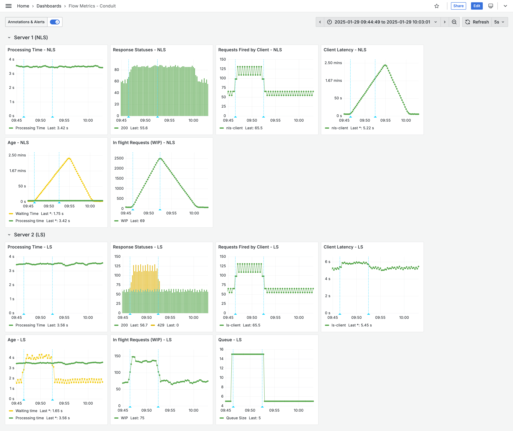
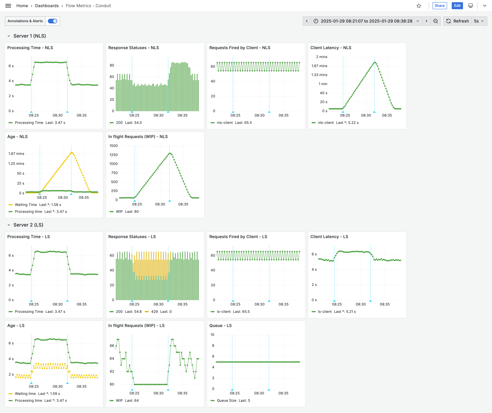

# monster-scale-2025

Use of Flow Metrics in Designing Resilient Systems

## Starting the system

```bash
mvn spring-boot:run
```

## Monitoring

- Prometheus runs
  on [http://localhost:9090/](http://localhost:9090/query?g0.expr=http_server_requests_active_seconds_max&g0.show_tree=0&g0.tab=graph&g0.range_input=1h&g0.res_type=auto&g0.res_density=medium&g0.display_mode=lines&g0.show_exemplars=0)
-

### Grafana

- Grafana runs on [localhost:3000](localhost:3000)
- Default user/password `admin`, updated to `admin` and `admin123`
- Use `Prometheus server URL` as `host.docker.internal:9090`


### Simulating load
Experiment 1: Traffic spike
- server-processing-time-sec=3
- client-concurrency=20

Experiment 2: Degraded dependency
- server-processing-time-sec=6
- client-concurrency=10

## Result 1: Traffic Spike


## Result 2: Degraded Dependency


## Notes

I generated the modules using

```bash
mvn archetype:generate -DgroupId=me.mourjo -DartifactId=ls-client -DarchetypeArtifactId=maven-archetype-quickstart -DinteractiveMode=false
```
